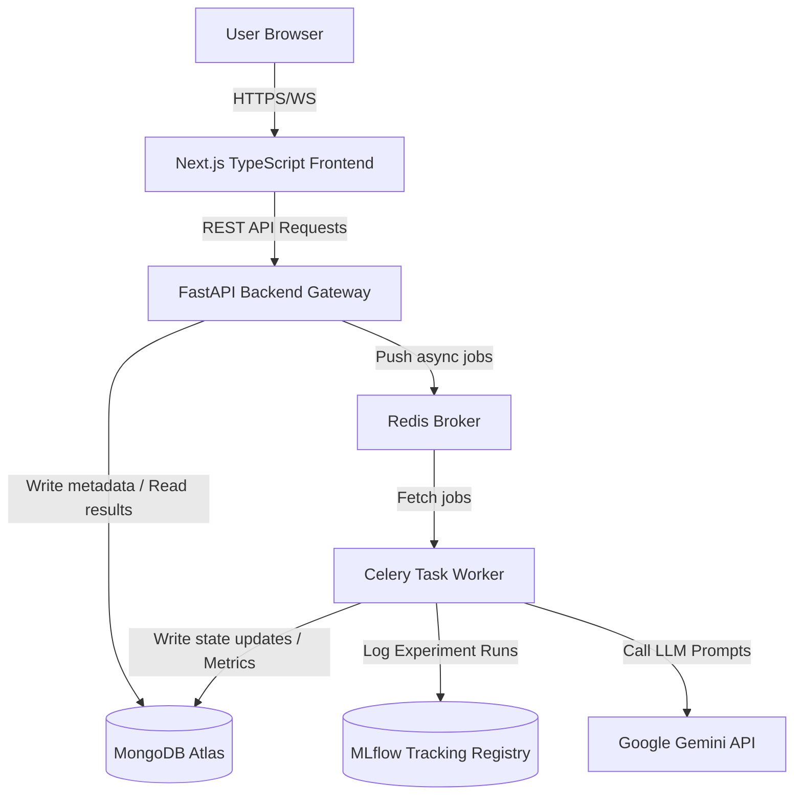

# System Architecture: InsightAI

InsightAI is a modular, AI-powered Business Intelligence and data analytics platform.

---

## Architecture Diagram

---

## System Layers

### 1. Frontend Workspace UI (`frontend/`)
Built with **Next.js**, **React**, **TypeScript**, and **Tailwind CSS**. It contains dashboards for:
* Dataset upload and profiling.
* Cleaning operations pipeline audit logs.
* Machine Learning model parameters setup, model comparison charts, and metrics tables.
* Time-series forecast chart visualization.
* Model explainability panels rendering SHAP global contribution bar coordinates and LIME local predictors.
* AI Copilot workspace chat panel, report generator, and intelligent recommendation cards.

### 2. REST API Gateway (`backend/app/routes/`)
Built with **FastAPI** on Python. Provides validated endpoints for projects, datasets, models, forecasts, AI chat sessions, and Celery jobs. Fully protected by JWT Bearer authentication and rate-limiting middleware.

### 3. Background Job Queue (`backend/app/tasks/`)
Utilizes **Celery** with **Redis** to offload long-running analytical operations. Training a model, forecasting a series, generating SHAP plots, and generating copilot documents are run asynchronously.

### 4. Machine Learning & Forecasting (`backend/app/ml/`)
Powered by **Scikit-learn**, **XGBoost**, **Statsmodels**, **Prophet**, **SHAP**, and **LIME**. 
* Grouped into isolated modules for preprocessing, training, forecasting, and explainability.
* Integrates with **MLflow** to catalog hyperparameters, validation scoring metrics, and serialized model files.
